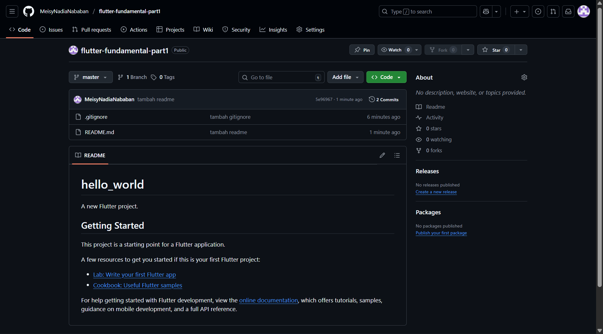
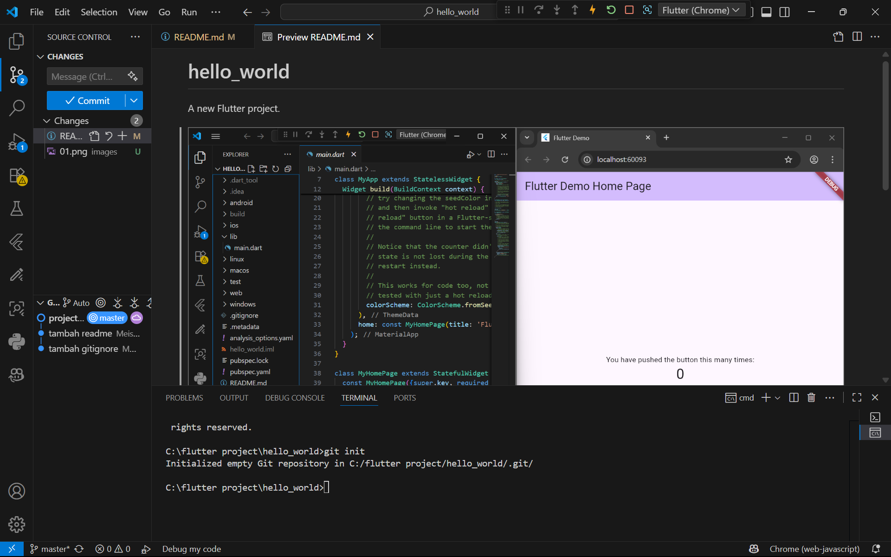

Nama: Meisy Nadia Nababan
 NIM: 2341760031
 Kelas: SIB 3F
 Mata Kuliah: Pemrograman Mobile

Praktikum 1: Membuat Project Flutter Baru
1. Proses pembuatan project baru selesai.

Praktikum 2: Menghubungkan Perangkat Android atau Emulator
Melanjutkan dari praktikum 1, Anda diminta untuk menjalankan aplikasi ke perangkat fisik (device Android atau iOS). Silakan ikuti langkah-langkah pada codelab tautan berikut ini.

https://developer.android.com/codelabs/basic-android-kotlin-compose-connect-device?hl=id#0

Praktikum 3: Membuat Repository GitHub dan Laporan Praktikum
1. Buat repository baru dengan nama "flutter-fundamental-part1"

2. Kembali ke VS code, project flutter hello_world, buka terminal pada menu Terminal > New Terminal. Lalu ketik perintah berikut untuk inisialisasi git pada project.

3. Pilih menu Source Control di bagian kiri, lalu lakukan stages (+) pada file .gitignore untuk mengunggah file pertama ke repository GitHub.

4. Beri pesan commit "tambah gitignore" lalu klik Commit (✔)
 
5. Lakukan push dengan klik bagian menu titik tiga > Push
 
6. Di pojok kanan bawah akan tampil seperti gambar berikut. Klik "Add Remote"
 
7. Salin tautan repository Anda dari browser ke bagian ini, lalu klik Add remote
 
8. Setelah berhasil, tulis remote name dengan "origin"
 
9. Commit juga pada README
 
10. Setelah itu berhasil tampil kedua file yang di push
 
11. Lakukan push juga untuk semua file lainnya dengan pilih Stage All Changes. Beri pesan commit "project hello_world". Maka akan tampil di repository GitHub seperti berikut.
 
 
12. Kembali ke VS Code, ubah platform di pojok kanan bawah ke emulator atau device atau bisa juga menggunakan browser Chrome. Lalu coba running project hello_world dengan tekan F5 atau Run > Start Debugging. Tunggu proses kompilasi hingga selesai, maka aplikasi flutter pertama akan tampil seperti berikut.
 
13. Silakan screenshot seperti pada Langkah 11, namun teks yang ditampilkan dalam aplikasi berupa nama lengkap Anda. Simpan file screenshot dengan nama 01.png pada folder images (buat folder baru jika belum ada) di project hello_world Anda. Lalu ubah isi README.md seperti berikut, sehingga tampil hasil screenshot pada file README.md. Kemudian push ke repository. 
 
 

Praktikum 4: Menerapkan Widget Dasar
1. Buat folder baru basic_widgets di dalam folder lib. Kemudian buat file baru di dalam basic_widgets dengan nama text_widget.dart. 
 
  Lakukan import file text_widget.dart ke main.dart, lalu ganti bagian text widget dengan kode di atas. Maka hasilnya seperti gambar berikut. Screenshot hasil milik, lalu dibuat laporan pada file README.md.
 
2. Buat sebuah file image_widget.dart di dalam folder basic_widgets dengan isi kode berikut.
 
  Jangan lupa sesuaikan kode dan import di file main.dart kemudian akan tampil gambar seperti berikut.
 

Praktikum 5: Menerapkan Widget Material Design dan iOS Cupertino
1. Buat file di basic_widgets > loading_cupertino.dart. Import stateless widget dari material dan cupertino. Lalu isi kode di dalam method Widget build adalah sebagai berikut.
 
 
2. Button widget terdapat beberapa macam pada flutter yaitu ButtonBar, DropdownButton, TextButton, FloatingActionButton, IconButton, OutlineButton, PopupMenuButton, dan ElevatedButton.
 Buat file di basic_widgets > fab_widget.dart. Import stateless widget dari material. Lalu isi kode di dalam method Widget build adalah sebagai berikut.
 
3. Scaffold widget digunakan untuk mengatur tata letak sesuai dengan material design. Ubah isi kode main.dart seperti berikut
 
4. Dialog widget pada flutter memiliki dua jenis dialog yaitu AlertDialog dan SimpleDialog.
Ubah isi kode main.dart seperti berikut.
 
5. Flutter menyediakan widget yang dapat menerima input dari pengguna aplikasi yaitu antara lain Checkbox, Date and Time Pickers, Radio Button, Slider, Switch, TextField. Contoh penggunaan TextField widget adalah sebagai berikut:
 
6. Date and Time Pickers termasuk pada kategori input dan selection widget, berikut adalah contoh penggunaan Date and Time Pickers.
 
 